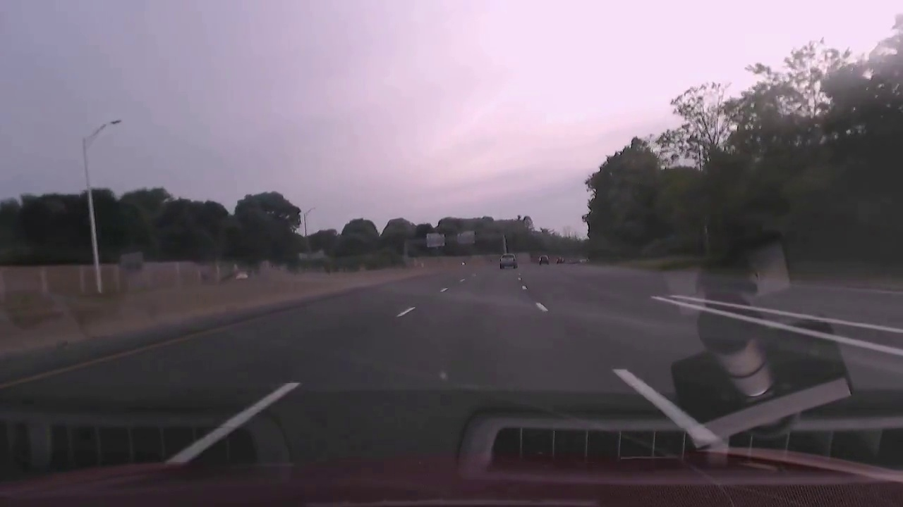

# Deep Learning for Self-Driving Cars : DeepTesla
http://selfdrivingcars.mit.edu/deeptesla/
  
## 题目描述
本项目中，需要利用MIT 6.S094 这门公开课中的Tesla数据集训练深度学习模型，根据车辆的前置相机所拍摄的路况图像，实现对车辆转向角度的预测。

## 数据
主要包括tesla在两种不同驾驶模式（human driving和autopilot）下的前置相机录制的视频和车辆的转向控制信号。

数据格式如下:
  
  - 前置相机记录的视频: 截图如下
  
    

 
- 行驶过程中的控制信号: CSV格式

    ts_micro         | frame_index | wheel 
    ------------------|-------------|-------
      1464305394391807 | 0           | -0.5  
      1464305394425141 | 1           | -0.5  
      1464305394458474 | 2           | -0.5  

其中，`ts_micro`是时间戳，`frame_index`是帧编号，`wheel`是转向角度（以水平方向为基准，+为顺时针，-为逆时针）

## 环境配置
* 本项目使用python3 + keras + tensorflow + jupyter notebook来完成。

## 项目运行
* 本项目模型训练部分使用了floydhub进行云计算，计算设备选择为floydhub提供最基础的GPU。所有模型总体训练时长约一个半钟头。其中绝大多数内容均在`DeepTesla.ipynb`上进行

## 项目目录
*  epochs/ 这里包含训练所需的视频和转向信号（文件太大未上传，可通过[百度云](https://pan.baidu.com/s/1c2J2IFA)下载）
*  images/ 这里包含生成结果视频所需的媒体文件
*  models/ 这里包含训练好的模型，包括`model.json`和`model.h5`以及所有其他模型
*  graphs/ 这里包含在项目过程中所有生成的统计图，结果图和模型结构图
*  output/ 这里应包含模型在`epoch10_front.mkv`上的表现效果(文件太大未上传，可通过[百度云](https://pan.baidu.com/s/1qZyIc80)下载或在线观看)
*  report/ 这里包含项目开题报告和总结报告，包含word和pdf版
*  utils.py 这里包含读取模型、生成视频等函数
*  params.py 这里包含一些默认设置
*  preprocess.py 这里包含数据预处理函数
*  run.py 这里包含生成结果视频的主程序
*  DeepTesla.ipynb 这里包含整个项目的实现流程以及各种统计分析和结果展示
*  report.html 这里为`DeepTesla.ipynb`的html版
  
## 参考资料
* [课程讲义](https://www.dropbox.com/s/q34bi7t0udms01x/lecture3.pdf?dl=1)提供了很好的入门介绍，原链接在dropbox，国内用户可以从[百度云](https://pan.baidu.com/s/1slmfBLb)下载。
* [课程项目介绍](http://selfdrivingcars.mit.edu/deeptesla/)阐述了实现思路(ConvNetJS)。
* [课程网页应用](http://selfdrivingcars.mit.edu/deepteslajs/)提供了试验环境，可以测试模型的效果。
* 除了课程介绍之外的几个有用的课程和论文:
    - [End to End Learning for Self-Driving Cars](https://images.nvidia.com/content/tegra/automotive/images/2016/solutions/pdf/end-to-end-dl-using-px.pdf)
    - [Dataset and code for 2016 paper "Learning a Driving Simulator" ](https://github.com/commaai/research/blob/master/train_steering_model.py)
    - [CS231n Convolutional Neural Networks for Visual Recognition](http://cs231n.github.io/neural-networks-1/)
